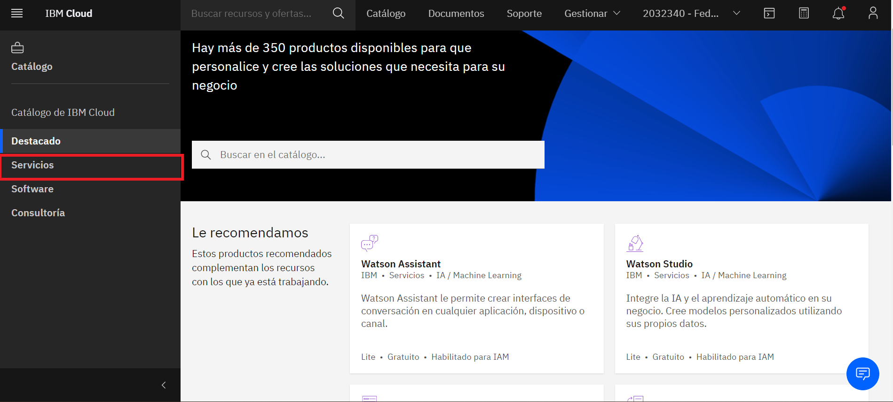
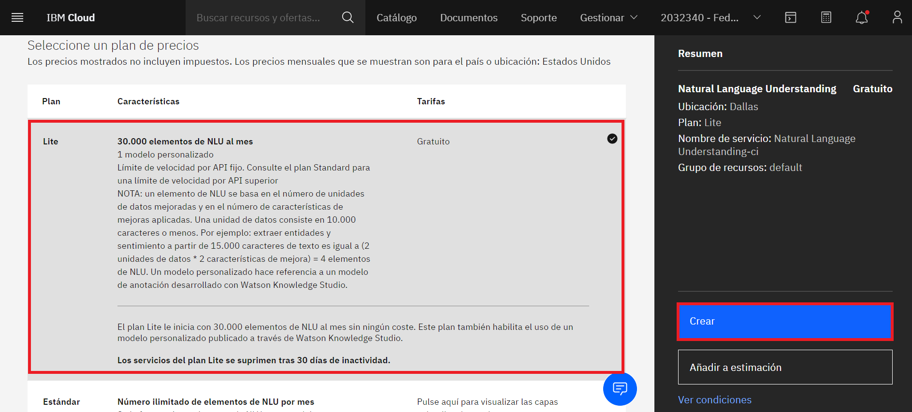

# Watson-NLU-Workshop
Natural-language understanding (NLU) es un subtema del procesamiento de lenguaje natural en la inteligencia artificial que se ocupa de la comprensión de lectura automática. En este laboratorio vamos a usar Watson Natural Language Understanding (WNLU) para extraer palabras clave de un conjunto de datos y poder analizarlas para conocer el sentimiento que expresa. Esto lo haremos con un Jupyter Notebook y utilizando las APIs de Python, posteriormente usaremos Pandas, Matlib y Seaborn para poder visualizar la información y extraer más datos importantes de la información.

En este taller aprenderas a:
- Crear y usar una instancia de Watson Natural Understanding 
- Conectarte a Watson NLU por medio de APIs de Python
- Realizar un análisis de texto para sacar palabras clave, sentimientos y emociones
- Mostrar la información de manera gráfica para entender mejor los datos.

## Antes de empezar te recomendamos:
* Realizar el [PreWork](#PreWork).
* Si eres estudiante o profesor y tienes correo institucional te recomendamos los [Cupones](#Cupones-para-profesores-y-estudiantes).
* Si tienes algun codigo promocional te decimos como [Aplicarlos](#Cargar-créditos-en-IBM-Cloud).

## PreWork
* Cuenta de [IBM Cloud][url-IBMCLOUD].
* Instalar [CLI de IBM Cloud][url-CLI-IBMCLOUD].
* Cuenta en [GitHub][url-github-join].
* Instalar [CLI de GitHub][url-github-cli] o instalar [GitHub Desktop][url-githubdesktop].
* Utilizar safari, chrome, firefox, edge.
* "Fork" y "Clone" a este repositorio. 

## Cupones para profesores y estudiantes:

* Acceder al portal de [IBM Academic Initiative][url-academic] y seleccionar la opción "Register now" si aun no tienes cuenta.
* Realizar el registro correspondiente utilizando la cuenta de correo académica y confirma tu cuenta.
* Despues de confirmar tu cuenta, y con la sesion iniciada en IBM Academic Initiative, en la parte de "Most Popular Topics covered", encontraremos **IBM Cloud** y damos click en "Learn more".
* Bajamos de la pagina hasta encontrar "Software". Le damos click, nos dara un apartado que se llama "Request Feature Code".
* Nos dara nuestro codigo. Lo copiamos y lo llevamos a **IBM Cloud**.

## Cargar créditos en IBM Cloud:

* En la parte superior derecha, buscaremos la parte de "MANAGE"/"GESTIONAR", nos desplegara una lista y seleccionaremos "Account"/"Cuenta".
* De lado izquierdo, tendremos una opción "Account settings"/"Configuracion de cuenta".
* Bajamos un poco hasta encontrar "Subscription and feature codes"/"Codigos de suscripción y carateristicas".
* Da click en "Apply code"/"Aplicar codigo".
* Ingresamos el codigo y click en "Apply"/"Aplicar".

[url-academic]: https://my15.digitalexperience.ibm.com/b73a5759-c6a6-4033-ab6b-d9d4f9a6d65b/dxsites/151914d1-03d2-48fe-97d9-d21166848e65/home/
[url-IBMCLOUD]: https://cloud.ibm.com/registration
[url-CLI-IBMCLOUD]: https://cloud.ibm.com/docs/cli/reference/ibmcloud?topic=cloud-cli-install-ibmcloud-cli
[url-github-join]: https://github.com/join
[url-github-cli]: https://git-scm.com/book/en/v2/Getting-Started-Installing-Git
[url-githubdesktop]: https://desktop.github.com/
[url-node]: https://nodejs.org/es/download/

## Cupones para profesores y estudiantes:
- Acceder al portal de IBM Academic Initiative y seleccionar la opción "Register now" si aun no tienes cuenta.
- Realizar el registro correspondiente utilizando la cuenta de correo académica y confirma tu cuenta.
- Despues de confirmar tu cuenta, y con la sesion iniciada en IBM Academic Initiative, en la parte de "Most Popular Topics covered", encontraremos IBM Cloud y damos clic en "Learn more".
- Bajamos de la pagina hasta encontrar "Software". Le damos clic, nos dara un apartado que se llama "Request Feature Code".
- Nos dara nuestro codigo. Lo copiamos y lo llevamos a IBM Cloud.

## Cargar créditos en IBM Cloud:
- En la parte superior derecha, buscaremos la parte de "MANAGE"/"GESTIONAR", nos desplegara una lista y seleccionaremos "Account"/"Cuenta".
- De lado izquierdo, tendremos una opción "Account settings"/"Configuracion de cuenta".
- Bajamos un poco hasta encontrar "Subscription and feature codes"/"Codigos de suscripción y carateristicas".
- Da clic en "Apply code"/"Aplicar codigo".
- Ingresamos el codigo y clic en "Apply"/"Aplicar".

## Contenido 

1. Crear una instancia de [Watson NLU][url-nlu]
2. Demostración de Watson NLU y Análisis de Sentimientos
3. Cargar y Ejecutar un cuaderno

[url-nlu]: https://cloud.ibm.com/catalog/services/natural-language-understanding

## Crear una instancia de Watson NLU
1. Haga click en el menú de navegación en la esquina superior izquierda de su instancia de Cloud Pak for Data y haga click en Services -> Services catalog

2. En la barra de busqueda ponga "Natural Language Understanding" y de click en Natural Language Understanding:

3. Escoga el plan gratuito Lite (solo puede tener una instancia Lite en su cuenta, si ya cuenta con otra tendrá que borrarla para que esta sea nueva o bien pagar por tener otra instancia). Pongale un nombre con el que pueda identificar la instancia:

4. Usted podrá ver su nueva instancia de NLU en la página de "Services instances". De click en el nombre para abrir la página de su nueva instancia:

5. Haga click en la pestaña de Credenciales o haga click en "Ver credenciales del servicio" para navegar a la página de credenciales:

6. De click en Crear credenciales. Después dar click en la flecha hacia abajo para ver las nuevas credenciales creadas. De los datos que que se muestran necesitarás la "api key" y el "url" por lo que se recomienda que las copies en un lugar seguro o bien dejes la pestaña abierta:

Tenga en cuenta que puede acceder al tutorial "Getting Started" y a la referencia de la API desde su isntancia de NLU en la pestaña de "Overview". Tal vez quiera echarles un vistazo para investigar más a fondo de Watson NLU.

## Demostración de Watson NLU y Análisis de Sentimientos

1. Visite https://www.ibm.com/demos/live/natural-language-understanding/self-service/home. De click en el botón "Analyze Text"

2. De click en las pestañas "Extraction", "Classification", "Linguistics" y en "Custom". Puede notar que hay sub-pestañas en cada una donde se muestra información más detallada.

3. De click en la pestaña "Classification" y en la sub-pestaña "Emotion". Aquí puede ver como NLU extra información sobre la emocion que tiene el texto.

Puede ver las puntuaciones de confianza para cada una de las diversas frase objetivo que se extrajeron en el análisis, siendo "Tristeza", "Alegría", "Miedo", "Desagrado" y "Enojo".

Ahora que ha visto como trabaja NLU y el Análisis de Sentimientos, usaremos las APIs de Python en un cuaderno de Jupyter junto con herramientas para graficar y visualizar los datos.

## Cargar y Ejecutar un cuaderno

1. Vaya a su proyecto en Cloud Pak for Data 

**falta imagen

2. En su proyecto, de click en "Add to project" y escoja "Notebook":

3. Seleccione "New Notebook from URL". Copie y pege el siguient URL: 
https://github.com/ibmdevelopermx/Watson-NLU-Workshop/blob/9392b702ec018ad32b6276170e07043efcd67c0d/Notebook/Watson_NLU.ipynb
De click en "Create":

Dedique tiempo a examinar las secciones del cuaderno para obtener una descripción general. Un cuaderno se compone de celdas de texto (markdown o heading) y celdas de código. Las celdas de markdown proporcionan comentarios sobre para qué está diseñado el código.

Ejecutará celdas individualmente resaltando cada celda, luego haga clic en el botón Ejecutar en la parte superior del cuaderno o presione el atajo de teclado para ejecutar la celda (Shift + Enter, pero puede variar según la plataforma). Mientras la celda se está ejecutando, aparecerá un asterisco ([*]) a la izquierda de la celda. Cuando esa celda haya terminado de ejecutarse, aparecerá un número secuencial (es decir, [17]).
